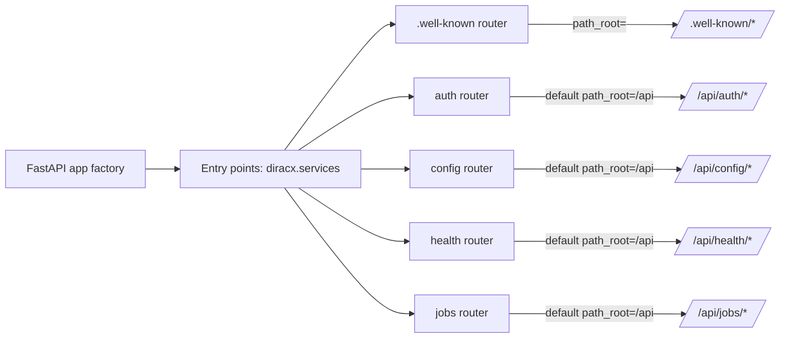
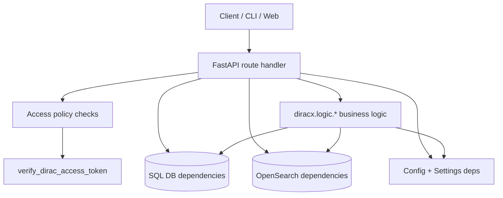

# DiracX Routers API map and component interactions

This document maps **all API routes exposed by `diracx-routers`** and shows how each route interacts with other code components (logic layer, DB layer, settings/config, and access policies).

## 1) Router mounting and URL roots

DiracX discovers routers through the `diracx.services` entry points and mounts them with:

- default prefix: `/api/<system_name>`
- exception: routers can override `path_root` (e.g. `.well-known` uses empty root)
- optional global auth dependency for routers with `require_auth=True`



## 2) Cross-cutting interaction model



## 3) Full endpoint inventory + interactions

## `.well-known` router (public metadata, no auth)

| Method | Path | Handler | Main interactions |
|---|---|---|---|
| GET | `/.well-known/openid-configuration` | `get_openid_configuration` | Calls `diracx.logic.auth.well_known.get_openid_configuration`; uses `Request.url_for(...)`, `Config`, `AuthSettings`. |
| GET | `/.well-known/jwks.json` | `get_jwks` | Calls `diracx.logic.auth.well_known.get_jwks`; uses `AuthSettings`. |
| GET | `/.well-known/dirac-metadata` | `get_installation_metadata` | Calls `diracx.logic.auth.well_known.get_installation_metadata`; uses `Config`. |
| GET | `/.well-known/security.txt` | `get_security_txt` | Returns static text (no DB/logic calls). |

## `auth` router (`/api/auth/*`, router-level auth disabled)

| Method | Path | Handler | Main interactions |
|---|---|---|---|
| POST | `/api/auth/token` | `get_oidc_token` | Calls `diracx.logic.auth.token.get_oidc_token`; uses `AuthDB`, `AuthSettings`, available security properties, and enriches tokens through all loaded access policies before signing via `create_token`. |
| GET | `/api/auth/legacy-exchange` *(hidden from schema)* | `legacy_exchange` | Calls `diracx.logic.auth.token.perform_legacy_exchange`; then mints access/refresh tokens via policy enrichment + `create_token`. |
| POST | `/api/auth/device` | `initiate_device_flow` | Calls `diracx.logic.auth.device_flow.initiate_device_flow`; uses `AuthDB`, `AuthSettings`. |
| GET | `/api/auth/device` | `do_device_flow` | Calls `diracx.logic.auth.device_flow.do_device_flow`; uses `AuthDB`, `AuthSettings`; returns redirect response for auth completion UI. |
| GET | `/api/auth/device/complete` | `complete_device_flow` | Calls `diracx.logic.auth.device_flow.finish_device_flow`; uses `AuthDB`, `AuthSettings`. |
| GET | `/api/auth/device/complete/finished` | `device_flow_finished` | Returns static completion HTML/text response. |
| GET | `/api/auth/authorize` | `initiate_authorization_flow` | Calls `diracx.logic.auth.authorize_code_flow.initiate_authorization_flow`; uses `AuthDB`, `AuthSettings`, `Config`, query params/state validation. |
| GET | `/api/auth/authorize/complete` | `complete_authorization_flow` | Calls `diracx.logic.auth.authorize_code_flow.complete_authorization_flow`; uses `AuthDB`, `AuthSettings`, `Config`. |
| GET | `/api/auth/refresh-tokens` | `get_refresh_tokens` | Calls `diracx.logic.auth.management.get_refresh_tokens`; subject derived from verified access token; uses `AuthDB`. |
| POST | `/api/auth/revoke` | `revoke_refresh_token_by_refresh_token` | Calls `diracx.logic.auth.management.revoke_refresh_token_by_refresh_token`; uses `AuthDB`, current subject. |
| DELETE | `/api/auth/refresh-tokens/{jti}` | `revoke_refresh_token_by_id` | Calls `diracx.logic.auth.management.revoke_refresh_token_by_jti`; uses `AuthDB`, current subject. |
| GET | `/api/auth/userinfo` | `userinfo` | Returns profile from validated access token payload (`verify_dirac_access_token`). |

## `config` router (`/api/config/*`, authenticated unless overridden)

| Method | Path | Handler | Main interactions |
|---|---|---|---|
| GET | `/api/config/` | `serve_config` | Uses `Config` dependency; ETag and Last-Modified conditional request logic; marked `@open_access` (no policy callback), but router still requires token. |

## `health` router (`/api/health/*`, no auth)

| Method | Path | Handler | Main interactions |
|---|---|---|---|
| GET | `/api/health/live` | `liveness` | Checks config dependency is available; no DB calls. |
| GET | `/api/health/ready` | `ready` | Calls `AuthDB.ping()` to verify DB readiness. |
| GET | `/api/health/startup` | `startup` | Calls `AuthDB.ping()` to verify startup dependencies. |

## `jobs` router (`/api/jobs/*`, authenticated)

| Method | Path | Handler | Main interactions |
|---|---|---|---|
| POST | `/api/jobs/jdl` | `submit_bulk_jobs` | Enforces WMS policy `ActionType.CREATE`; calls `diracx.logic.jobs.submission.submit_jdl_jobs`; uses `Config`, `JobDB`, `JobLoggingDB`, `TaskQueueDB`, `JobParametersDB`. |
| POST | `/api/jobs/sandbox` | `create_sandbox` | Enforces Sandbox policy `ActionType.CREATE`; calls `diracx.logic.jobs.sandboxes.initiate_sandbox_upload`; uses `SandboxMetadataDB`, `SandboxStoreSettings`. |
| GET | `/api/jobs/sandbox` | `download_sandbox_file` | Enforces Sandbox policy `ActionType.READ` on PFN; calls `diracx.logic.jobs.sandboxes.get_sandbox_file`; uses `SandboxMetadataDB`, `SandboxStoreSettings`. |
| GET | `/api/jobs/{job_id}/sandbox` | `get_job_sandboxes` | Enforces WMS `ActionType.READ`; calls `diracx.logic.jobs.sandboxes.get_job_sandboxes`; uses `SandboxMetadataDB`. |
| GET | `/api/jobs/{job_id}/sandbox/{sandbox_type}` | `get_job_sandbox` | Enforces WMS `ActionType.READ`; calls `diracx.logic.jobs.sandboxes.get_job_sandbox`; uses `SandboxMetadataDB`. |
| PATCH | `/api/jobs/{job_id}/sandbox/output` | `assign_sandbox_to_job` | Enforces WMS `ActionType.MANAGE`; calls `diracx.logic.jobs.sandboxes.assign_sandbox_to_job`; uses `SandboxMetadataDB`, `SandboxStoreSettings`. |
| DELETE | `/api/jobs/{job_id}/sandbox` | `unassign_sandbox_from_job` | Enforces WMS `ActionType.MANAGE`; calls `diracx.logic.jobs.sandboxes.unassign_jobs_sandboxes`; uses `SandboxMetadataDB`. |
| POST | `/api/jobs/sandbox/output/unassign` | `unassign_jobs_sandboxes` | Enforces WMS `ActionType.MANAGE`; calls `diracx.logic.jobs.sandboxes.unassign_jobs_sandboxes`; uses `SandboxMetadataDB`. |
| POST | `/api/jobs/search` | `search_jobs` | Enforces WMS `ActionType.QUERY`; calls `diracx.logic.jobs.query.search`; uses `Config`, `JobDB`, `JobParametersDB`; supports pagination + filter normalization. |
| POST | `/api/jobs/summary` | `summary_jobs` | Enforces WMS `ActionType.QUERY`; calls `diracx.logic.jobs.query.summary`; uses `Config`, `JobDB`, `JobParametersDB`. |
| PATCH | `/api/jobs/status` | `set_job_statuses` | Enforces WMS `ActionType.MANAGE`; calls `diracx.logic.jobs.status.set_job_statuses`; uses `Config`, `JobDB`, `JobLoggingDB`, `TaskQueueDB`, `JobParametersDB`. |
| PATCH | `/api/jobs/heartbeat` | `add_heartbeat` | Enforces WMS `ActionType.PILOT`; calls `diracx.logic.jobs.status.add_heartbeat`, then `get_job_commands`; uses `Config`, `JobDB`, `JobLoggingDB`, `TaskQueueDB`, `JobParametersDB`. |
| POST | `/api/jobs/reschedule` | `reschedule_jobs` | Enforces WMS `ActionType.MANAGE`; calls `diracx.logic.jobs.status.reschedule_jobs`; uses `Config`, `JobDB`, `JobLoggingDB`, `TaskQueueDB`, `JobParametersDB`. |
| PATCH | `/api/jobs/metadata` | `patch_metadata` | Enforces WMS `ActionType.MANAGE`; calls `diracx.logic.jobs.status.set_job_parameters_or_attributes`; uses `JobDB`, `JobParametersDB`. |

## 4) Job/API interaction diagram (deep view)

```mermaid
flowchart LR
  subgraph JobsAPI[/api/jobs/*]
    S1[POST /jdl]
    S2[POST /search]
    S3[PATCH /status]
    S4[PATCH /heartbeat]
    S5[Sandbox endpoints]
  end

  S1 --> WMSP[WMSAccessPolicy.check(ActionType.CREATE)]
  S2 --> WMSQ[WMSAccessPolicy.check(ActionType.QUERY)]
  S3 --> WMSM[WMSAccessPolicy.check(ActionType.MANAGE)]
  S4 --> WMSPilot[WMSAccessPolicy.check(ActionType.PILOT)]
  S5 --> SBP[Sandbox/WMS policy checks]

  S1 --> LSub[logic.jobs.submission]
  S2 --> LQuery[logic.jobs.query]
  S3 --> LStatus[logic.jobs.status]
  S4 --> LStatus
  S5 --> LSbox[logic.jobs.sandboxes]

  LSub --> JobDB[(JobDB)]
  LSub --> JobLogDB[(JobLoggingDB)]
  LSub --> TQDB[(TaskQueueDB)]
  LSub --> JPDB[(JobParametersDB)]

  LQuery --> JobDB
  LQuery --> JPDB
  LStatus --> JobDB
  LStatus --> JobLogDB
  LStatus --> TQDB
  LStatus --> JPDB
  LSbox --> SMDB[(SandboxMetadataDB)]
  LSbox --> SStore[SandboxStoreSettings]
```

## 5) Quick notes on auth + policy behavior

- Global route auth is injected by the app factory when `DiracxRouter(require_auth=True)`.
- Per-route authorization is expected to call a policy dependency (`WMSAccessPolicy` / `SandboxAccessPolicy`) unless the route is intentionally marked `@open_access`.
- Access policies are extension-aware and can be overridden via `diracx.access_policies` entry points.
