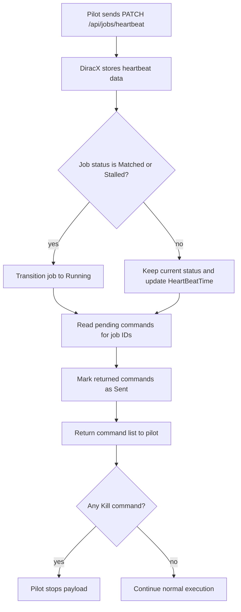

# Job heartbeats and commands

The `/api/jobs/heartbeat` endpoint is the control loop between pilots (or JobAgents)
and DiracX Workload Management. It has two responsibilities:

1. **Liveness and runtime telemetry**: update heartbeat information (`HeartBeatTime`
   plus dynamic fields like `Vsize`, `CPUConsumed`, etc.).
2. **Command delivery**: return queued commands that the pilot should execute for a
   specific job, currently `Kill`.

In practice, this behaves like a lightweight per-job command queue:

- Commands are enqueued by WMS actions (for example, setting a job to `Killed` or
  `Deleted` stores a `Kill` command for the payload).
- The next heartbeat for that job returns the command.
- Returned commands are marked as sent, so repeated heartbeats do not return the
  same command again.

This keeps the execution control flow asynchronous: operators or automation can
request an action in the WMS, and pilots pick it up on their next heartbeat without
requiring a direct RPC channel from the server to worker nodes.

## Heartbeat and command flow

## Why commands are attached to heartbeats

Using heartbeats for command retrieval means:

- no inbound connectivity to worker nodes is required,
- command latency is bounded by the heartbeat interval,
- command delivery is naturally scoped to active jobs.

This is currently used mainly for kill semantics and can be extended for additional
pilot-side actions in future.
