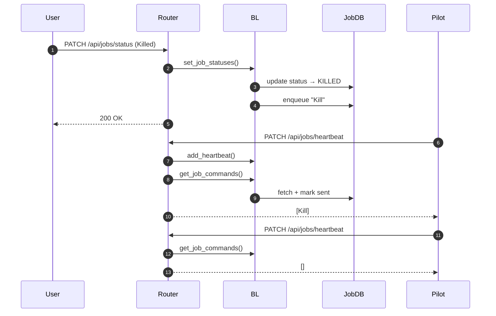
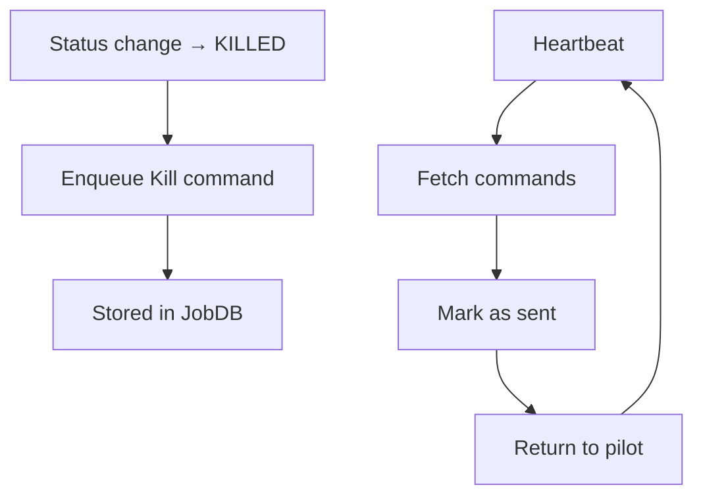

## Job Heartbeat & Commands – Documentation and Tests

This addresses issue #445 by:

- Adding router-level tests for heartbeat and job commands.
- Documenting the purpose and lifecycle of job commands.
- Providing diagrams for clarity.

---

## What Are Job Commands?

Job commands implement a **per-job control queue** between the WMS and the pilot (JobAgent).

They allow the WMS to send control instructions to running jobs via the heartbeat mechanism.

Currently used for:

- Remote job termination (`Kill` command)

The mechanism is generic and could support additional commands in the future (e.g. debug actions, core dump requests, etc.).

---

## Behaviour Summary

### Command Creation

When a job transitions to a terminal state (`KILLED` or `DELETED`),  
`set_job_statuses()` enqueues a `Kill` command in the JobDB.

### Command Delivery

Commands are delivered during:

```text
PATCH /api/jobs/heartbeat
```

Flow:

1. Heartbeat updates job state.
2. `get_job_commands()` retrieves pending commands.
3. Commands are marked as sent.
4. Commands are returned to the pilot.

This guarantees **one-shot delivery semantics**:

- A command is delivered exactly once.
- It is not re-delivered on subsequent heartbeats.

---

## Sequence Diagram (Kill Command Lifecycle)



---

## Activity View



---

## Tests Added

Router-level tests verify:

- Heartbeat returns `list[JobCommand]`.
- Kill command is created when status → `KILLED`.
- Kill command is delivered exactly once.
- Subsequent heartbeats return no duplicate commands.
- Non-terminal status transitions do not create commands.

This confirms correct queue semantics and router wiring.****